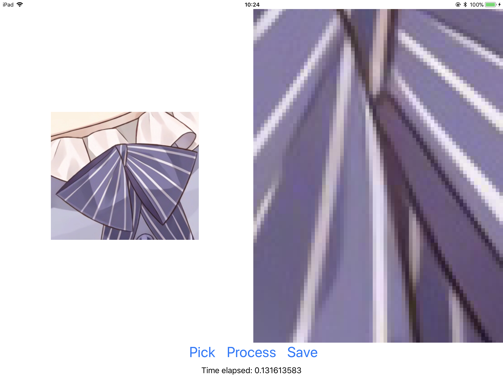
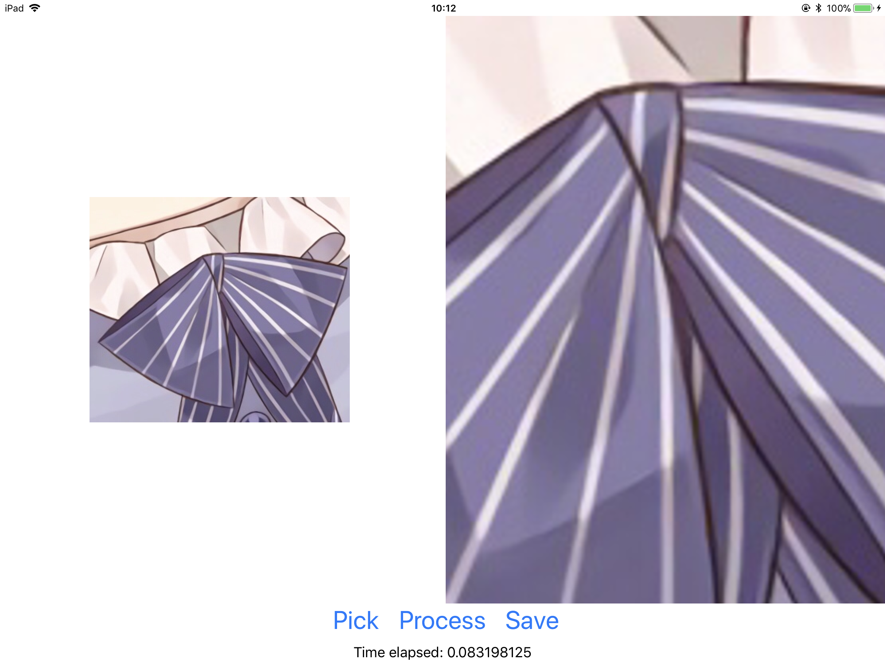

# MetalResize
This is a fast image-resizing framework written in [Metal Performance Shaders](https://developer.apple.com/documentation/metalperformanceshaders). It supports images with RGBA channels.

## Interpolation
 - [Nearest-neighbor](https://en.wikipedia.org/wiki/Nearest-neighbor_interpolation)
 - [Bilinear](https://en.wikipedia.org/wiki/Bilinear_interpolation)
 - [Bicubic](https://en.wikipedia.org/wiki/Bicubic_interpolation)

## Demo
This image is scaled to 8x in all methods.
### Nearest-neighbor

### Bilinear

### Bicubic

Image source: [https://www.pixiv.net/member_illust.php?mode=medium&illust_id=62665989](https://www.pixiv.net/member_illust.php?mode=medium&illust_id=62665989)
